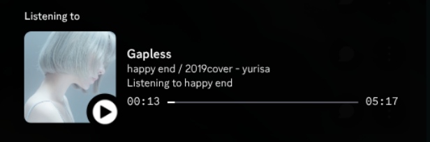

# G4music / Gapless Discord Rich Presence
Discord Rich Presense for [Gapless](https://gitlab.gnome.org/neithern/g4music)

<div align="center">


</div>

## Features
- Highly customisable
- Templating for various fields
- Buttons with customisable text and url
- Cover art display (through [litterbox](https://litterbox.catbox.moe))
- Position display

## Installation

> [!CAUTION]
> g4music, and hence g4music-discord-rpc, do NOT work on Windows.

There are 2 options for installation:
1. Pypi
```sh
python3 -m pip install g4music-discord-rpc
```
2. Running from source
```sh
git clone https://github.com/x-9917638/g4music-discord-rpc
cd g4music-discord-rpc
python3 -m pip install -r requirements.txt
python3 src/main.py
```

## Configuration
g4music-discord-rpc will create a default configuration at $XDG_CONFIG_HOME/g4music-discord-rpc/config.toml

### Default:
```toml
[general]
appid = 1436573238636576891
cover-art = true
show-time = true
log-level = 30

[details]
text = ""
url = ""

[state]
text = "${song} / ${album} - ${artist}"
url = ""

[image]
text = "Listening to ${song}"
url = ""

[buttons.1]
text = ""
url = ""

[buttons.2]
text = ""
url = ""
```

### Options:
| Option Name | Explanation | Type | Default |
| :--- | :--- | :--- | :--- |
| `general.appid` | The application that the activity is set as. [You are free to create your own](https://discord.com/developers/applications/), with customised fallback, play and pause icons. | integer | `1436573238636576891` |
| `general.cover-art` | Whether or not to display cover art. Please note that if this is `true`, art will be uploaded to [litterbox](https://litterbox.catbox.moe) anonymously. | boolean | `true` |
| `general.show-time` | Whether or not to show the position that you are at and the length of the song. | boolean | `true` |
| `general.log-level` | The level of logs that are sent to stdout. Acceptable levels are 30 WARN, 20 INFO, 10 DEBUG. | integer | `30` |
| `details.text` | The text to display in the details section of the activity. Templating is allowed. Leave as an empty string if unwanted. | string | `""` |
| `details.url` | The URL that clicking on the activity's details text will open. Leave as an empty string if unwanted. | string | `""` |
| `state.text` | The text to display in the state section of the activity, typically below the details. Templating is allowed. | string | `"${song} / ${album} - ${artist}"` |
| `state.url` | The URL that clicking on the activity's state text will open. Leave as an empty string if unwanted. | string | `""` |
| `image.text` | The tooltip text shown when hovering over the large album art. Templating is allowed. | string | `"Listening to ${song}"` |
| `image.url` | The URL that clicking on the large album art will open. Leave as an empty string if unwanted. | string | `""` |
| `buttons.*.text` | The text to display on the first button in the activity. A button will only appear if both its text and url attributes are filled. | string | `""` |
| `buttons.*.url` | The URL that clicking the button will open. A button will only appear if both its text and url attributes are filled. The url must be of format `http://`* or `https://*`. | string | `""` |

### Templating
Templating allows strings to be dynamic dependent on the current song.

To use templating, wrap the desired field with curly brackets and prefix a $. e.g.`${song}`

There are 3 valid fields:
| Field | Explanation |
| ----- | ----------- |
| ${song} | The title of the current song. |
| ${artist} | The artist of the current song |
| ${album} | The name of the album from the current song |

## License
g4music-discord-rpc is licensed under the MIT License. The full license can be found [here](https://github.com/x-9917638/g4music-discord-rpc/blob/main/LICENSE).
